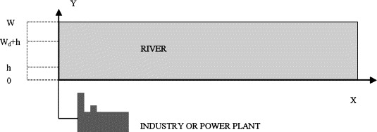
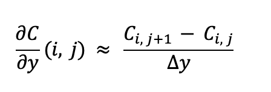
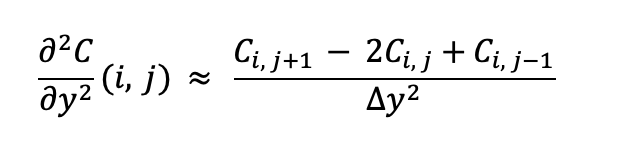

# Modelamiento de la dispersión de un contaminante en un río chileno (Río Maipo)
Este repositorio contiene el código, datos y figuras del proyecto "Modelamiento de fenómenos de transporte para Chile", en este caso de la dispersión de un contaminante en un río. Siendo un modelo 2D y estacionario.
## Descripción del proyecto
El proyecto desarrolla un modelo matemático y computacional para analizar la dispersión de contaminantes en ríos chilenos, específicamente en la cuenca del río Maipo, una de las más relevantes del país por abastecer cerca del 80% del agua potable de la Región Metropolitana.

La problemática principal que aborda es la contaminación hídrica generada por descargas industriales, junto con la creciente presión sobre los ecosistemas y los desafíos derivados del SEIA (Sistema de Evaluación de Impacto Ambiental) y la "permisología", que han ralentizado la inversión en Chile y dificultan la evaluación ambiental de nuevos proyectos.

La relevancia en el contexto chileno se relaciona con que el río Maipo fue declarado Zona Saturada por ocho contaminantes, superando normas por más de tres años consecutivos, lo que refleja una crisis ambiental que amenaza tanto el consumo humano como la biodiversidad. A la vez, la incertidumbre técnica en la evaluación de impactos ambientales retrasa permisos, afectando la inversión y el crecimiento del país.

El proyecto se vincula directamente con los desafíos de sustentabilidad al proponer un modelo que permite predecir de manera rigurosa la dispersión de contaminantes, evaluar escenarios y justificar normativas de dilución. Esto contribuye a mejorar la gestión de cuencas, apoyar decisiones basadas en evidencia y acelerar procesos de evaluación ambiental sin relajar estándares, ayudando a equilibrar desarrollo económico y protección de los recursos hídricos, uno de los pilares de la sustentabilidad en Chile.

## Sistema físico modelado
El sistema corresponde a un río de **geometría rectangular**, con un ancho transversal $W$, largo ($L_x$) y profundidad $p(x)$. En la orilla se ubica una industria que descarga de manera continua un contaminante a través de un difusor horizontal ubicado entre ($y = h$) y ($y = h + W_d$), como ocurre en el caso del vertimiento de GRASCO S.A. en el río Maipo.
Se adjunta una imagen del sistema.

Este tipo de descarga genera una **pluma de contaminante** que se desplaza y se mezcla con el agua del río a lo largo del eje longitudinal (x) y transversal (y) del cauce.

**Componentes principales del sistema:**
- El río, representado como un canal bidimensional (x–y), de profundidad moderada. Presenta un perfil de velocidad que varía espacialmente, siendo mayor en el centro del cauce y menor en las orillas debido al rozamiento. El perfil de velocidad esta relacionado con la profundidad $p(x)$ del río.
  
    El río posee:
  - Velocidad longitudinal $u(x,y)$
  - Velocidad transversal $v(x,y)$ (cero en nuestro modelo)
  - Mezcla turbulenta lateral caracterizada por un coeficiente de difusión εy

- El difusor o punto de descarga, ubicado en una posición lateral del río, descargando un caudal continuo de efluente con concentración conocida. Su ubicación y longitud respecto a la orilla determina la forma inicial de la pluma.

- El contaminante, sin reacción química compleja. Su concentración evoluciona debido al transporte de masa y al decaimiento químico $K_e$.

La **formulación física** está gobernado por procesos de **transporte de masa**, específicamente:

**1. Advección:** El contaminante es arrastrado por la velocidad del río $u(x,y)$, lo que genera el movimiento predominante en el eje longitudinal. Consideramos $v(x,y) = 0$ al implementar el modelo. Pero en la realidad, sí existe advección en el eje $y$ también.
**2. Difusión turbulenta lateral:** Describe la mezcla del contaminante en el eje transversal $y$ debido a la turbulencia del flujo. Está representada mediante un coeficiente εy
**3. Decaimiento químico:** Se incorpora mediante un término de desaparición proporcional a la concentración, con constante $k_e$.
   
Estos mecanismos se acoplan para formar la ecuación diferencial parcial bidimensional utilizada en el modelo:

donde:

- $C(x,y)$: concentración del contaminante
- $u(x,y)$: velocidad longitudinal
- $v(x,y)$: velocidad transversal
- εy: difusividad turbulenta lateral
- $k_e$: coeficiente de decaimiento

Las **condiciones de borde** son las siguientes:

1. Concentración en la entrada (x = 0, y ):
   
    $C(0,y) = C0$    si   $h <= y <= h + Wd$
    
    $C(0,y) = 0$     en otro caso

2. En las "paredes" del río no hay flujo de contaminante, no difunde hacia afuera del dominio. En $y = 0$ y $y = W$
   
   $dC/dy = 0$

Los **supuestos** adoptados en este modelo son los siguientes:
1.	Estado Estacionario
2.	Modelo horizontal bidimensional
3.	Difusión longitudinal despreciable
4.	Fluido Newtoniano
5.	Mezcla Binaria
6.	El flujo promedio no cambia con el tiempo
7.	El río presenta leves variaciones en su profundidad en la longitudinal.

## Descripción del método númerico utilizado
En este problema se resuelve la concentración estacionaria $C(x,y)$ mediante la discretización de diferencias finitas sobre una malla rectangular y con el método iterativo SOR (Successive Over-Relaxation).

El **método de diferencias finitas** se basa en aproximar las derivadas por cocientes de diferencias evaluados en puntos de una malla. Cada derivada se reemplaza por una combinación lineal de valores de la función en nodos vecinos. De este modo, una ecuación diferencial parcial continua se transforma en un sistema lineal algebraico que aproxima la solución en un conjunto discreto de puntos.

El uso de **SOR** es apropiado porque la ecuación discretizada es de tipo elíptico (difusión con advección estacionaria), lo que genera un sistema lineal grande pero bien condicionado para métodos iterativos. Además, SOR permite resolver el problema sin ensamblar explícitamente la matriz completa, trabajando nodo a nodo, lo que simplifica la implementación y reduce el consumo de memoria.

### Pasos para la discretización
(1) **Se definió un dominio** rectangular en las direcciones longitudinal y transversal con una malla uniforme:

$x_i$ $= i△x$, $i = 0,1,...,N_x$

$y_j$ $= j△y$, $j = 0,1,...,N_y$

Y en cada nodo se define: $C_{ij}$, $u_{ij}$ y $v_{ij}$

(2) Se **aproximaron las derivadas**:

Derivada en x:

Derivada en y:

Segunda derivada en y:

*Para las primeras derivadas se utilizó la aproximación de primer orden para mantener la estabilidad en la solución, y que el modelo llegara a converger. Para la derivada de segundo orden se utilizó la aproximación de segundo orden. Además se utilizarón las aproximaciones hacia atrás en las primeras derivadas ("esquema unwind"). Este esquema “upwind” es apropiado cuando la advección domina en la dirección x (número de Peclet grande), ya que evita oscilaciones numéricas y favorece la estabilidad del método.*

(3) **Ecuación discreta** en cada nodo:

Que puede reordenarse para dejar $C_{ij}$ en términos de sus vecinos, lo que genera un sistema lineal de la forma $AC=b$. Lo cual más adelante se utilizará en el método SOR.

(4) Se discretizan las **condiciones de borde**:

**Resolución del sistema con el método SOR**

Una vez armado el sistema discreto, se resolvió mediante el método de Sobre-Relajación Sucesiva (SOR).

El algoritmo se resume en:
- Inicializar un campo de concentración $cC_{ij}$ y aplicar las condiciones de borde
- Se definen los coeficientes SOR, a partir del reordenamiento de la ecuación discretizada.
- Recorrer todos los nodos interiores calculando el residuo y actualizando $cC_{ij}$ con SOR.
- Reaplicar condiciones de borde.
- Calcular el residuo medio global; si es mayor que una tolerancia fijada, continuar iterando.
- Detener cuando el residuo cae por debajo de la tolerancia, obteniendo el campo estacionario de concentración.

**Justificación del método**

El método numérico elegido es adecuado para el problema por varias razones:
1. Geometría simple y malla estructurada: El río se modela como un dominio rectangular 2D, ideal para una malla regular y para aplicar diferencias finitas de forma directa.

2. Fenómeno estacionario y elíptico: Al trabajar en estado estacionario, la ecuación se vuelve de tipo elíptico, para la cual los métodos de diferencias finitas con SOR son útiles.

3. Régimen de advección dominante en $x$: El uso de esquemas “upwind” en la dirección del flujo permite manejar correctamente números de Peclet altos, evitando oscilaciones no físicas en la solución y **manteniendo estabilidad** numérica.

4. Difusión lateral bien representada: La aproximación central de segundo orden en $y$ captura de manera razonable la mezcla transversal debida a la turbulencia, que es el mecanismo clave de homogenización en la sección.

5. Flexibilidad para incorporar perfiles de velocidad realistas: El método permite incluir un perfil de velocidad longitudinal $u(x,y)$ dependiente de la profundidad y de la posición, lo que acerca el modelo a la hidrodinámica real del río Maipo.

6. Eficiencia computacional: SOR ofrece una buena relación entre simplicidad, estabilidad y tiempo de cómputo *(cercano a 1 minuto)* para mallas del tamaño considerado, permitiendo obtener soluciones de alta resolución sin necesidad de métodos más complejos.

En conjunto, la combinación de diferencias finitas + SOR + esquemas “upwind” entrega un método numérico coherente con la física del problema, estable para un régimen advectivo–difusivo y suficientemente preciso para analizar la dispersión de contaminantes en la cuenca del río Maipo en el contexto de evaluaciones ambientales y sustentabilidad.

## Instrucciones para implementar el código

El código es ejecutado en la version 3.13.5 de python. Las librerías necesarias son numpy, matplotlib y scipy.

El archivo "ModeloSOR1.ipynb" corresponde al código utilizado para $u(x,y)$ constante y el archivo "ModeloSOR2.ipynb" corresponde a $u(x,y) variable en función de la profundidad en x. Ambos códigos estan en formato Jupyter y Python y se ejecutan de igual manera.

Para el análisis de datos se ejecutaron dos casos distintos, uno en el que $u(x,y)$ era constante, y otro en el que existe una función relacionada a la profundidad en x. Ambos casos consideran $v(x,y) = 0$.

El código completo se ejecuta dentro de un único archivo Python y no requiere archivos adicionales.

El archivo del código contiene:
+ Definición de parámetros físicos
+ Construcción de la malla
+ Cálculo del campo de velocidad $u(x,y)$ **en el primer caso se considera la $u(x,y)$ constante (no es un campo), y en el segundo se define a partir de la información del modelo**
+ Definición de los coeficientes numéricos del esquema SOR
+ Implementación del algoritmo iterativo
+ Aplicación de condiciones de borde
+ Iteración del SOR
+ Gráficos finales de resultados

Para el primer caso el código de resolución es simple, mientras que en el segundo caso se complejiza un poco más y se incorpora el campo de velocidad.

En ambos casos, para ejecutar el código solamente hay que descargarlo y ejecutar el script.
*Considerando que este modelo es especifico para el río Maipo, los valores de los parámetros fueron determinados y justificados en el informe.*

## Resultados

Los resultados se pueden observar de manera clara con los gráficos formados con el código. A continuación se presentan gráficos que sintetizan los principales resultados.

Al comparar los perfiles $C(y)$ considerando $u(x,y)$ constante v/s en función de la profundidad se ve lo siguiente:
(1).png) (2).png)

Al haber velocidades muy distintas, la difusión lateral no alcanza a mezclar el contaminante hacia regiones donde la advección es más rápida.
El río se vuelve un sistema con zonas de transporte eficiente (en el centro) y zonas lentas (cerca del difusor), lo que reduce la mezcla.
Cuando $u(x,y)$ es constante se logra una mezcla muy rápida --> La pluma se abre como un “abanico”, alcanza casi toda la sección transversal y se atenúa suavemente.
Y cuando es variable se logra una mezcla lenta y poco uniforme. El contaminante queda “pegado” a la orilla del difusor, porque la velocidad más baja ahí reduce la advección, la velocidad alta del centro del río se lleva agua limpia antes de que el contaminante llegue.

Esto es precisamente lo que ocurre en ríos reales, donde la velocidad no es uniforme, y depende de varios factores, que al considerarlos permiten un resultado más preciso.

Por eso el segundo caso es más realista y más coherente físicamente.

Con los otros gráficos formados se puede concluir lo mismo.

*Todos los gráficos de resultados se encuentran en la carpeta "Resultados".*

